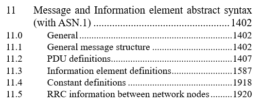
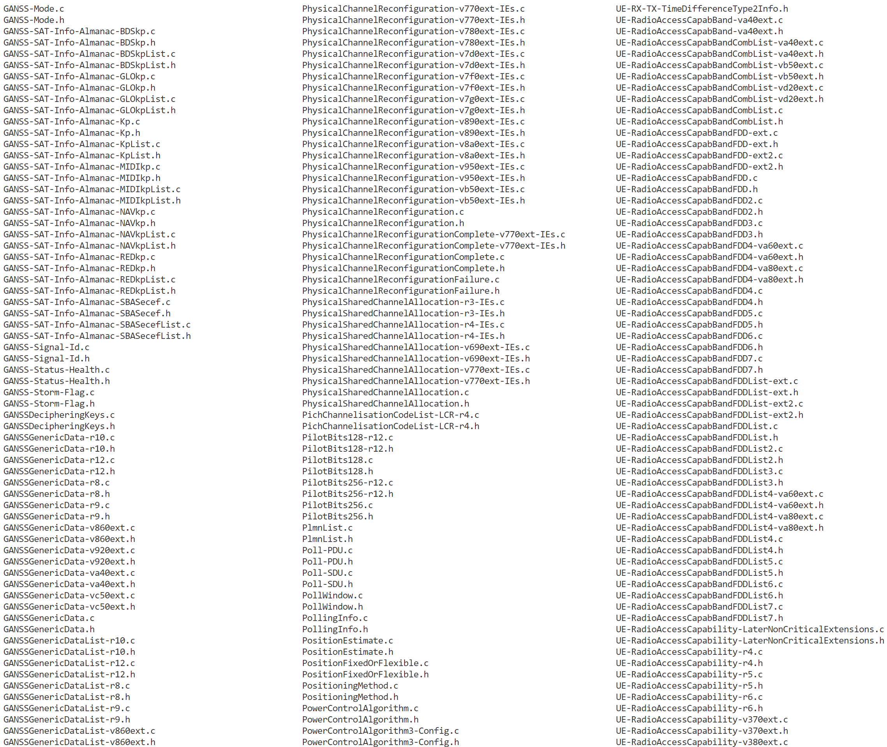

# asn1c-devcontainer

The purpose of this devcontainer is to provide an example how one can work with the `ASN.1` in C language.

## ASN.1

The `Abstract Syntax Notation One` (`ASN.1`) is a standard interface description language (IDL) for defining data structures that can be serialized and deserialized in a cross-platform way ([https://en.wikipedia.org/wiki/ASN.1](https://en.wikipedia.org/wiki/ASN.1)). It supports multiple encodings and in this example XER and DER are used.

The ASN.1 is joint standard by the `International Telecommunication Union Telecommunication Standardization Sector` (`ITU-T`).

The `ASN.1: Communication between Heterogenous Systems` is a book by Olivier Dubuisson, and it has been translated from French by Philippe Fouquart. It was published in June 5th 2000, but it is still very relevant.

[https://www.oss.com/asn1/resources/books-whitepapers-pubs/dubuisson-asn1-book.PDF](https://www.oss.com/asn1/resources/books-whitepapers-pubs/dubuisson-asn1-book.PDF)

## asn1c

The `asn1c` ([https://github.com/vlm/asn1c](https://github.com/vlm/asn1c)) is an ASN.1 compiler by Lev Walkin. It can be used for compiling the ASN.1 modules and generating the required code which then can be used in other applications.

## ASN.1 and 3GPP

The `3rd Generation partnership Project` (`3GPP`) is a standards organization responsible of standards used in telecommunication.

[https://www.3gpp.org/](https://www.3gpp.org/)

The ASN.1 is widely used in the telecommunication standards.

### Radio Resource Control

The `Radio Resource Control` (`RRC`) protocol is great example of an application of the ASN.1. In the 3GPP 15.4.0 release the chapter 11 of the RRC protocol specification, there exists five ASN.1 modules.



If one extracts the modules from the specification and compiles them with the `asn1c` compiler the outcome is over 8900 generated .h and .c files containing almost 1000000 lines of code! The ASN.1 modules themselves are over 42000 lines.



The 3GPP 15.4.0 release can be downloaded from the 3GPP. It is not the latest release, but it is currently most widely adopted release.

[https://portal.3gpp.org/desktopmodules/Specifications/SpecificationDetails.aspx?specificationId=1180](https://portal.3gpp.org/desktopmodules/Specifications/SpecificationDetails.aspx?specificationId=1180)

## ASN.1 Example

In this devcontainer there exists a simple example how one can use the ASN.1.

### Observation ASN.1 module

The Observation module can be found at `modules/observation.asn`. It contains a three dimensional coordinate and a timestamp.

```asn1
ObservationModule DEFINITIONS ::= BEGIN

Observation ::= SEQUENCE {
    x               REAL,        -- x-coordinate
    y               REAL,        -- y-coordinate
    z               REAL,        -- z-coordinate
    timestamp       INTEGER      -- timestamp
}

END

```

### Generate

At first, generate the based on the ASN.1 module.

```
make generate
```

After that the generated files appear under `src/generated`.

```
[dev@5a3b0e9811f1 asn1c-devcontainer]$ make generate
rm -rf src/generated &&\
mkdir src/generated &&\
cd src/generated &&\
asn1c ../../modules/observation.asn &&\
rm converter-sample.c &&\
sed -i 's/_BSD_SOURCE/_DEFAULT_SOURCE/g' asn_system.h &&\
sed -i 's/_BSD_SOURCE/_DEFAULT_SOURCE/g' REAL.c
Compiled Observation.c
Compiled Observation.h
Copied /usr/local/share/asn1c/INTEGER.h -> INTEGER.h
Copied /usr/local/share/asn1c/NativeEnumerated.h        -> NativeEnumerated.h
Copied /usr/local/share/asn1c/INTEGER.c -> INTEGER.c
Copied /usr/local/share/asn1c/NativeEnumerated.c        -> NativeEnumerated.c
Copied /usr/local/share/asn1c/NativeInteger.h   -> NativeInteger.h
Copied /usr/local/share/asn1c/NativeInteger.c   -> NativeInteger.c
Copied /usr/local/share/asn1c/NativeReal.h      -> NativeReal.h
Copied /usr/local/share/asn1c/NativeReal.c      -> NativeReal.c
Copied /usr/local/share/asn1c/REAL.h    -> REAL.h
Copied /usr/local/share/asn1c/REAL.c    -> REAL.c
Copied /usr/local/share/asn1c/constr_SEQUENCE.h -> constr_SEQUENCE.h
Copied /usr/local/share/asn1c/constr_SEQUENCE.c -> constr_SEQUENCE.c
Copied /usr/local/share/asn1c/asn_application.h -> asn_application.h
Copied /usr/local/share/asn1c/asn_system.h      -> asn_system.h
Copied /usr/local/share/asn1c/asn_codecs.h      -> asn_codecs.h
Copied /usr/local/share/asn1c/asn_internal.h    -> asn_internal.h
Copied /usr/local/share/asn1c/OCTET_STRING.h    -> OCTET_STRING.h
Copied /usr/local/share/asn1c/OCTET_STRING.c    -> OCTET_STRING.c
Copied /usr/local/share/asn1c/BIT_STRING.h      -> BIT_STRING.h
Copied /usr/local/share/asn1c/BIT_STRING.c      -> BIT_STRING.c
Copied /usr/local/share/asn1c/asn_codecs_prim.c -> asn_codecs_prim.c
Copied /usr/local/share/asn1c/asn_codecs_prim.h -> asn_codecs_prim.h
Copied /usr/local/share/asn1c/ber_tlv_length.h  -> ber_tlv_length.h
Copied /usr/local/share/asn1c/ber_tlv_length.c  -> ber_tlv_length.c
Copied /usr/local/share/asn1c/ber_tlv_tag.h     -> ber_tlv_tag.h
Copied /usr/local/share/asn1c/ber_tlv_tag.c     -> ber_tlv_tag.c
Copied /usr/local/share/asn1c/ber_decoder.h     -> ber_decoder.h
Copied /usr/local/share/asn1c/ber_decoder.c     -> ber_decoder.c
Copied /usr/local/share/asn1c/der_encoder.h     -> der_encoder.h
Copied /usr/local/share/asn1c/der_encoder.c     -> der_encoder.c
Copied /usr/local/share/asn1c/constr_TYPE.h     -> constr_TYPE.h
Copied /usr/local/share/asn1c/constr_TYPE.c     -> constr_TYPE.c
Copied /usr/local/share/asn1c/constraints.h     -> constraints.h
Copied /usr/local/share/asn1c/constraints.c     -> constraints.c
Copied /usr/local/share/asn1c/xer_support.h     -> xer_support.h
Copied /usr/local/share/asn1c/xer_support.c     -> xer_support.c
Copied /usr/local/share/asn1c/xer_decoder.h     -> xer_decoder.h
Copied /usr/local/share/asn1c/xer_decoder.c     -> xer_decoder.c
Copied /usr/local/share/asn1c/xer_encoder.h     -> xer_encoder.h
Copied /usr/local/share/asn1c/xer_encoder.c     -> xer_encoder.c
Copied /usr/local/share/asn1c/per_support.h     -> per_support.h
Copied /usr/local/share/asn1c/per_support.c     -> per_support.c
Copied /usr/local/share/asn1c/per_decoder.h     -> per_decoder.h
Copied /usr/local/share/asn1c/per_decoder.c     -> per_decoder.c
Copied /usr/local/share/asn1c/per_encoder.h     -> per_encoder.h
Copied /usr/local/share/asn1c/per_encoder.c     -> per_encoder.c
Copied /usr/local/share/asn1c/per_opentype.h    -> per_opentype.h
Copied /usr/local/share/asn1c/per_opentype.c    -> per_opentype.c
Copied /usr/local/share/asn1c/converter-sample.c        -> converter-sample.c
Generated Makefile.am.sample
```

### Observation Generator

Build the `observation-generator` program which takes the JSON as an input and then produces two output files: `observation.xer` and `observation.der`.

```
make build
```

The `observation-generator` program is located under `.build` once it has been compiled.

```
[dev@5a3b0e9811f1 asn1c-devcontainer]$ make build
rm -rf .build &&\
mkdir .build &&\
LD_LIBRARY_PATH=/usr/local/lib64 gcc -lm -lcjson src/observation-generator.c src/generated/*.c -I src/generated -o .build/observation-generator
```

### Observation JSON

There exists a input file called `observation.json`. It contains the input for the three dimensional coordinate and for the timestamp.

```json
{
    "x": 17.2,
    "y": 1.3,
    "z": 0.4,
    "timestamp": 1705830521
}
```

### Run Observation Generator

Run the `observation-generator`.

```
make run
```

The program will read the content of the `observation.json` file and encode the contents of it with XER and DER encodings, and writes two files: `observation.xer` and `observation.der`.

```
[dev@5a3b0e9811f1 asn1c-devcontainer]$ make run
rm -f observation.xml
.build/observation-generator --input observation.json
opened file /workspaces/asn1c-devcontainer/observation.json
read 74 bytes from file /workspaces/asn1c-devcontainer/observation.json
closed file /workspaces/asn1c-devcontainer/observation.json
parsed json data
retrieved all fields from JSON data
wrote file observation.xml with XER encoded Observation
wrote file observation.der with DER encoded Observation
```

The XER is human-readable as it is XML.

```
[dev@5a3b0e9811f1 asn1c-devcontainer]$ cat observation.xml
<Observation>
    <x>17.199999999999999</x>
    <y>1.3</y>
    <z>0.4</z>
    <timestamp>1705830521</timestamp>
</Observation>
```

The DER is not human-readable as it is binary format.

```
[dev@5a3b0e9811f1 asn1c-devcontainer]$ cat observation.der
0'              ��333333                ��������                ��
                                                                  ������e��y
```

One of the reasons why ASN.1 is widely adopted lies in the size of the files after encoding. The `observation.xml` is 127 bytes as the `observation.der` is 41 bytes, and the DER is not even the most efficient encoding available. The generated code also contains decorders for XER and DER encondings, but also encoder and decoder for BER and PER.

## Closing

Try it out!
